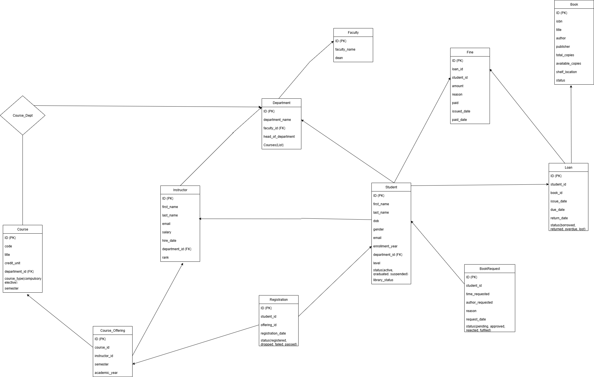
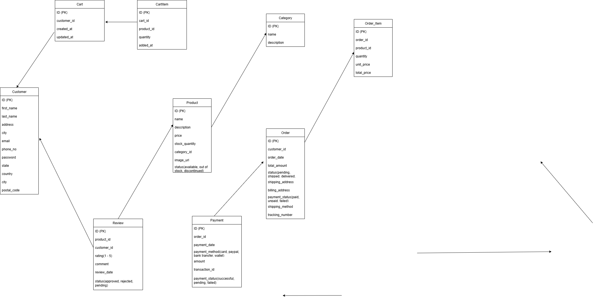
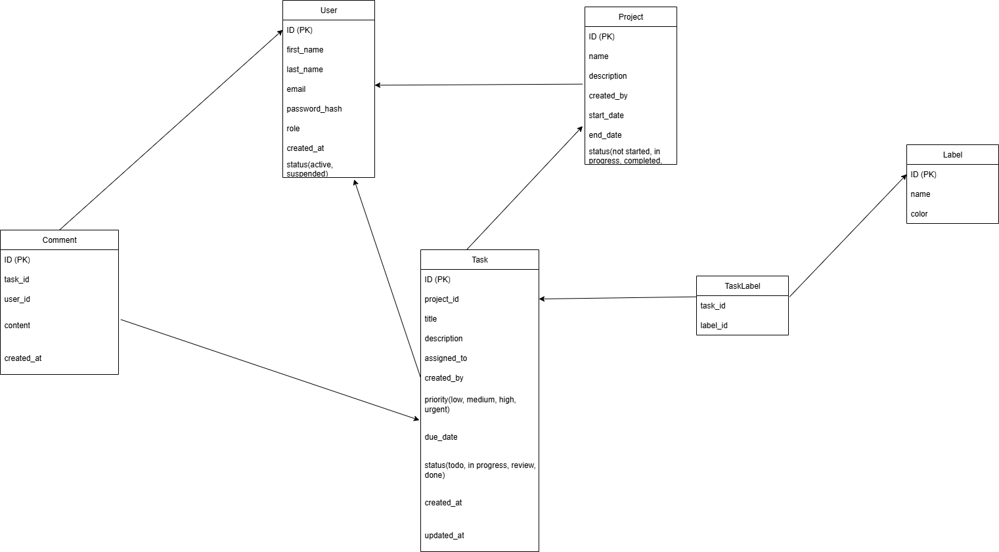

# Table of Contents

- [Table of Contents](#table-of-contents)
  - [Overview](#overview)
    - [Key Components](#key-components)
      - [Entities](#entities)
      - [Attributes](#attributes)
      - [Relationships](#relationships)
  - [Why ERDs Are Essential](#why-erds-are-essential)
    - [Clarity and Communication](#clarity-and-communication)
    - [Design and Development Efficiency](#design-and-development-efficiency)
    - [Problem Identification and Resolution](#problem-identification-and-resolution)
    - [Documentation and Maintenance](#documentation-and-maintenance)
  - [Best Practices](#best-practices)
  - [Getting Started](#getting-started)
  - [Tools and Software](#tools-and-software)
  - [Tools and Software Used](#tools-and-software-used)
  - [Practicals](#practicals)
    - [ERD - School Management System](#erd---school-management-system)
    - [ERD - E-Commerce System](#erd---e-commerce-system)
    - [ERD - Task Management System](#erd---task-management-system)
  - [Conclusion](#conclusion)

## Overview

An Entity-Relationship Diagram (ERD) is a high-level conceptual data model that visually represents the structure of a database. It illustrates how different entities (things or objects about which data is stored) relate to each other within a system. ERDs are widely used in database design to model the data requirements of a business process.

### Key Components

#### Entities
- **Representation**: Rectangles
- **Definition**: Real-world objects or concepts that have data stored about them
- **Examples**: `Customer`, `Product`, `Order`

#### Attributes
- **Representation**: Ovals
- **Definition**: Properties or characteristics of an entity
- **Examples**: For `Customer` entity - `CustomerID`, `Name`, `Email`

#### Relationships
- **Representation**: Diamonds or lines connecting entities
- **Definition**: Describe how entities interact with each other
- **Examples**: A `Customer` places an `Order`
- **Cardinality Types**:
  - One-to-one (1:1)
  - One-to-many (1:N)
  - Many-to-many (M:N)

## Why ERDs Are Essential

### Clarity and Communication
ERDs provide a clear, intuitive visual representation of database structure, making complex data relationships easy to understand. They serve as a common language between developers, database administrators, and business stakeholders, ensuring everyone understands the data requirements.

### Design and Development Efficiency
ERDs facilitate logical database design before physical implementation, helping identify all necessary tables, columns, and relationships. They reduce data redundancy by clearly mapping relationships, leading to more efficient storage and improved data integrity through proper primary and foreign key definitions.

### Problem Identification and Resolution
Potential issues like missing entities, incorrect relationships, or inefficient data flows can be identified and corrected early in the design phase, saving significant time and resources. Well-designed ERDs also help anticipate future data growth and system scalability needs.

### Documentation and Maintenance
ERDs act as vital documentation for database systems, making it easier for new team members to understand existing structures. When changes are required, ERDs provide a blueprint that simplifies database modification and expansion.

## Best Practices

1. **Start Simple**: Begin with major entities and relationships, then add details
2. **Use Clear Naming**: Choose descriptive names for entities and attributes
3. **Validate with Stakeholders**: Ensure the ERD accurately represents business requirements
4. **Normalize Data**: Eliminate redundancy and ensure data integrity
5. **Document Assumptions**: Include notes about business rules and constraints

## Getting Started

1. Identify the main entities in your system
2. Determine the attributes for each entity
3. Define relationships between entities
4. Specify cardinality for each relationship
5. Review and refine the diagram
6. Validate with stakeholders

## Tools and Software

Common ERD tools include:
- Lucidchart
- Draw.io
- MySQL Workbench
- ERDPlus
- Visual Paradigm
- Microsoft Visio

## Tools and Software Used
- Draw.io
- VS Code

## Practicals

### ERD - School Management System

### ERD - E-Commerce System

### ERD - Task Management System

## Conclusion

ERDs are fundamental tools for creating robust, efficient, and well-understood database systems. They act as the blueprint for data architecture, enabling better communication, design efficiency, and long-term maintainability of database systems.